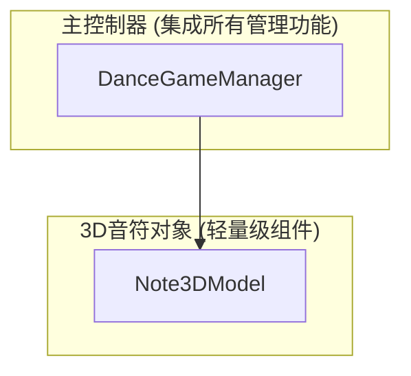

# 跳舞音乐游戏程序开发文档

## 1. 架构设计

### 1.1 最终架构设计

经过多次优化，最终确定为极简的2组件架构：



### 1.2 核心类设计

#### DanceGameManager (主控制器 - 集成所有管理功能)

```csharp
public class DanceGameManager : MonoBehaviour
{
    [SerializeField] private Note3DModel note3DPrefab;  // 音符3D预制体引用
    
    // 核心API接口
    public void Start(Action<(int correct, int wrong, int miss)> callback);
    
    // 集成功能模块：
    // - txt文件读取和音符数据解析
    // - 3D音符模型的生成和销毁管理
    // - 键盘输入监听和事件处理
    // - 按键时机判定和准确度计算
    // - 分数统计和最终结果回调
    // - 游戏生命周期管理（启动-运行-结束）
}
```

#### NoteData (音符数据结构)

```csharp
[System.Serializable]
public struct NoteData
{
    public float time;      // 音符时间
    public KeyCode key;     // 对应按键
}
````

#### Note3DModel (3D音符对象 - 简化版)

```csharp
public class Note3DModel : MonoBehaviour
{
    public NoteData noteData;
    
    // 简化功能：移动、视觉效果、销毁通知
    public void Initialize(NoteData data);
    public System.Action<Note3DModel> OnReachTarget;
}
```

## 2. 功能职责划分

### 2.1 DanceGameManager 核心职责

**集成的功能模块：**

* **数据管理**：txt文件读取、解析、音符数据存储、3D位置信息统一管理

* **游戏控制**：独立玩法系统的完整生命周期管理（启动-运行-结束）

* **音符管理**：3D音符模型的生成、销毁、起始和目标位置动态计算

* **输入处理**：键盘输入监听、按键事件处理、输入验证

* **判定系统**：按键时机判定、准确度计算、Perfect/Good/Miss评级

* **分数统计**：实时统计正确/错误/miss次数、最终结果回调

**配置参数：**

* **note3DPrefab**：音符3D预制体引用，用于生成音符实例

* 音符数据文件路径

* 生成点和目标点Transform

* 判定窗口时间设置

* 移动速度等游戏参数

### 2.2 Note3DModel 职责

**主要功能：**

* **移动控制**：从起点到目标点的3D移动

* **视觉表现**：根据按键类型显示不同材质/颜色

* **状态通知**：到达目标点时通知主控制器

* **自我管理**：简单的生命周期管理

## 3. 数据结构定义

### 3.1 核心数据类型

```csharp
// 判定类型枚举
public enum JudgmentType
{
    Perfect,
    Good,
    Miss,
    Wrong
}

// 音符数据结构
[System.Serializable]
public struct NoteData
{
    public float time;      // 音符时间
    public KeyCode key;     // 对应按键
}
```

## 4. Unity配置要求

### 4.1 场景设置

* 创建空GameObject作为DanceGameManager

* 设置音符生成点和目标点的Transform

* 配置摄像机位置以获得最佳视角

### 4.2 Prefab配置

**音符预制体要求：**
* 音符Prefab包含Mesh Renderer和Collider
* 添加Note3DModel脚本组件
* 配置不同按键对应的材质数组

**DanceGameManager配置：**
* 在Inspector中将音符预制体拖拽到note3DPrefab字段
* 确保预制体已正确配置Note3DModel组件

### 4.3 文件配置

* 音符数据文件放在StreamingAssets目录

* 支持运行时动态加载不同的音符序列

## 5. 最终架构优势

**极简架构的核心优势：**

* **组件数量最小化**：从最初的7个MonoBehaviour精简到仅2个核心组件

* **依赖关系简化**：消除了复杂的组件间通信，直接的调用关系

* **性能优化**：减少Update调用开销，降低事件传递成本

* **开发效率**：集中的逻辑管理，便于快速开发和调试

* **维护便利**：更少的类文件，清晰的职责划分，易于理解和修改

* **数据结构简洁**：NoteData只包含time和key两个核心字段，位置信息统一管理

